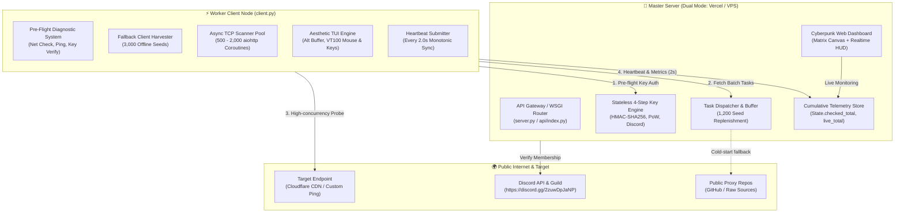
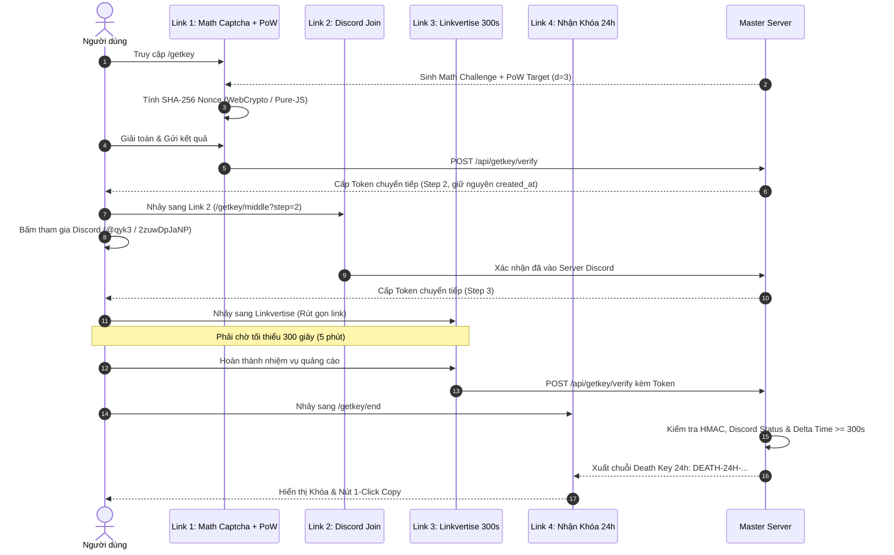

# 🏗️ BẢN THIẾT KẾ KIẾN TRÚC HỆ THỐNG (SYSTEM ARCHITECTURE)

> **Dự án**: `Death Proxy Scanner V1.0.0`  
> **Thương hiệu**: `Created By ! Death Silence - Discord: @qyk3`  
> **Tài liệu**: Bản vẽ kỹ thuật chuyên sâu về luồng dữ liệu, giao thức mạng và mô hình phân tán.

---

## 🌐 1. TỔNG QUAN MÔ HÌNH PHÂN TÁN (DISTRIBUTED TOPOLOGY)

Hệ thống hoạt động theo mô hình **Master - Worker** (Máy chủ điều phối trung tâm - Cụm nút thợ quét phân tán):



---

## 🔑 2. CƠ CHẾ CẤP KHÓA 4 BƯỚC STATELESS (4-STEP KEY GENERATION PIPELINE)

Hệ thống cấp khóa không đòi hỏi cơ sở dữ liệu nặng nề (SQL/Redis) mà sử dụng cơ chế **HMAC-SHA256 Stateless Token** tự kiểm chứng:



### Chi tiết cấu trúc Token Stateless:
- Token được định dạng dưới dạng: `dgk_<base64_payload>.<hmac_signature>`
- Payload chứa:
  - `step`: Bước hiện tại (1, 2, 3, 4).
  - `client_ip`: Địa chỉ IP của người dùng (chống chia sẻ token sang máy khác).
  - `created_at`: Mốc thời gian ban đầu lúc giải Captcha (bảo toàn xuyên suốt qua cả 4 bước).
  - `discord_verified`: Trạng thái đã xác minh Discord (`True`/`False`).
  - `expires_at`: Hạn dùng của token chuyển tiếp (15 phút).
- Chữ ký HMAC: `HMAC_SHA256(payload, MASTER_SECRET_SALT)` đảm bảo người dùng không thể can thiệp sửa đổi dữ liệu token.

---

## ⚡ 3. KHO HẠT GIỐNG PROXY 0MS (SEED HARVESTER ENGINE)

Một trong những cải tiến kiến trúc mang tính đột phá của V1.0.0 là **loại bỏ hoàn toàn nguy cơ đói nhiệm vụ (Task Starvation)** trên Serverless:

```text
[HTTP Request /api/tasks]
         │
         ▼
Bộ đệm Task Buffer còn đủ (>= 200)?
   ├── CÓ ──> Trả ngay 200-500 proxy cho Client (Thời gian: < 5ms)
   └── KHÔNG:
         │
         ├── BƯỚC 1 (0ms TỨC THÌ):
         │   Nạp ngay 1,200 proxy ngẫu nhiên từ kho SEED_PROXIES (seeds.py)
         │   vào Task Buffer.
         │
         └── BƯỚC 2 (NGẦM / DỰ PHÒNG):
             Khởi chạy luồng cào proxy từ 10 repo nguồn công khai trên GitHub.
             Nếu Vercel timeout mạng ngoài -> BƯỚC 1 đã bảo vệ hệ thống 100%!
```

- **Kho `seeds.py`**: Chứa hơn 3,000 proxy đa dạng giao thức (HTTP, HTTPS, SOCKS4, SOCKS5) từ hơn 40 quốc gia, được đóng gói trực tiếp dưới dạng mảng Python, nạp thẳng vào RAM khi khởi động.
- **Client Fallback**: Nếu đường truyền tới Master Server bị gián đoạn, `client.py` tự động kích hoạt `fallback_client_harvest()` để tiếp tục quét cục bộ mà không gián đoạn công việc của người dùng.

---

## 🖥️ 4. KIẾN TRÚC GIAO DIỆN TERMINAL CHỐNG RÁC (RESPONSIVE TUI ENGINE)

Hệ thống TUI của Client được thiết kế trên nền tảng kỹ thuật terminal hiện đại:

```text
+-------------------------------------------------------------------------+
|                        ALTERNATE SCREEN BUFFER                          |
|                       Escape Sequence: \033[?1049h                       |
+-------------------------------------------------------------------------+
|                                                                         |
|  1. Nhảy con trỏ về góc trái trên: \033[H                                |
|  2. Lấy kích thước thực tế: cols, lines = shutil.get_terminal_size()    |
|  3. Tính toán số dòng hiển thị động:                                    |
|     max_rows = min(12, max(2, lines - fixed_rows - 1))                  |
|  4. Bảng điều khiển viền bo tròn (Box.ROUNDED) với chiều rộng co giãn  |
|  5. Chuẩn hóa Badge quốc gia an toàn: [VN], [US], [DE] (Không lỗi font) |
|  6. Xóa sạch mọi ký tự rác từ con trỏ tới đáy màn hình: \033[J           |
|                                                                         |
+-------------------------------------------------------------------------+
|                      VT100 MOUSE & KEYBOARD LISTENER                    |
|  - Bắt phím Space, +, -, Q qua msvcrt (Windows) / termios (Linux)       |
|  - Bắt tọa độ click chuột qua Escape Sequence \033[<0;col;lineM          |
|  - Tự động chuẩn hóa tỷ lệ tọa độ click theo chiều rộng thực tế         |
+-------------------------------------------------------------------------+
```

---

## 📊 5. CƠ CHẾ ĐỒNG BỘ SỐ LIỆU ĐƠN ĐIỆU (MONOTONIC TELEMETRY SYNC)

Để tránh hiện tượng số liệu proxy quét được bị nhảy giật lùi khi các container Serverless khác nhau tiếp nhận request:

1. **Client gửi Heartbeat 2 giây/lần**:
   - Gói tin chứa cả `delta` (số proxy vừa quét được trong 2s qua) và `total_checked`, `total_live` (tổng tích lũy từ lúc mở tool).
2. **Server tổng hợp dữ liệu**:
   - `server.state.checked_total = max(server.state.checked_total, client_total_checked)`
   - `server.state.live_total = max(server.state.live_total, client_total_live)`
3. **Web Dashboard hiển thị**:
   - Canvas Matrix Code Rain chạy nền mượt mà 60 FPS bằng WebGL/HTML5 Canvas.
   - Thống kê thời gian thực: Tốc độ quét (req/s), tỷ lệ sống (Live Rate %), phân bố theo giao thức (HTTP/SOCKS) và quốc gia.
